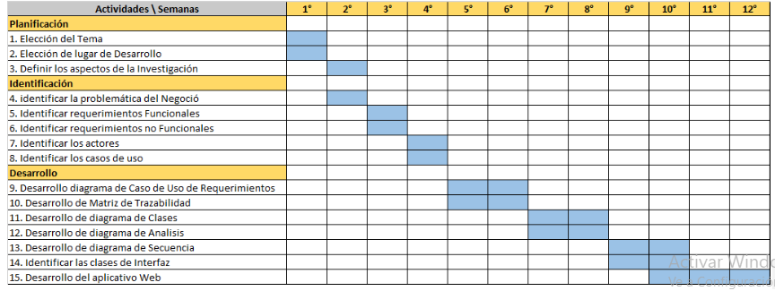

# PÁGINA WEB PARA LA CLINICA VETERINARIA ICAZA

INTEGRANTES:| PORCENTAJE DE TRABAJO
---|---
Esquivel Quinquin, Imanol (Orcid: 0000-0001-5555-5685) |100%
Huamani Neyra, Luis Antonio (Orcid: 0000-0002-2183-4528)|100%
Ramos Marcelo, Katherine Gume (Orcid: 0000-0002-8499-2291)) |100%
Montero Echevarria, Rubby Sahory (Orcid: 0000-0002-4420-0413) |100%
Obregón Moran, Max Smiht (Orcid: 0000-0001-9226-5388)|100%

## INTRODUCCIÓN:
En el siguiente informe podra encontrar toda la informacion recopilada por el equipo de trabajo para poder desarrollar el proyecto actual, el cual lleva por nombre **Página WEB para Clínica Veterinaria Icaza**.

Con ganas de mejorar y llegar a mas gente, la **LA CLINICA VETERINARIA ICAZA** solicito que se le desarrolle una pagina web la cual le permita al cliente realizar una solicitud para poder reservar y acceder a un **SERVICIO DE BAÑO VIP** para su mascota o engreido.

## ASPECTOS DE LA ORGANIZACIÓN
### 1.1 VISIÓN:

La Clínica Veterinaria Icaza al 2024 será líder en el sector de salud y cuidado de las mascotas a nivel lima metropolitana, dando el mejor servicio para su bienestar, brindando tratamientos a la vanguardia de la tecnología, con los métodos más actuales para beneficio de las mascotas.

### 1.2 MISIÓN:
Somos una institución comprometida con el cuidado de las mascotas, promoviendo la responsabilidad y el correcto cuidado hacia sus mascotas, teniendo en cuenta las situaciones de cada familia, de esta manera estamos convencidos que cada mascota es un miembro valioso en las familias peruanas y merecen tener el mejor cuidado y responsabilidad hacia ellos.

### 1.3 OBJETIVOS:

Dar soporte para implementar el servicio de Baños VIP
Diseñar una página web para la clínica veterinaria, que proponga agendar de manera fácil las citas.
Facilitar una plataforma a los clientes, para programar su cita dependiendo su disponibilidad.
Reducir el tiempo de espera a los clientes para la atención programada.
Facilitar el registro de los nuevos pacientes, y las atenciones realizadas en el día.

### 1.4 ANTECEDENTES:
Caruán, Pernía y Bartolomé (2003) de la Universidad de Alicante (España), se identificó la problemática la falta de existencia de páginas web con material para ser utilizados en las tareas, como solución de dicho problema se planteó la siguiente interrogante: “¿Qué características debe contar la página web para las personas que forman la comunidad educativa?” El objetivo fue la creación de una página web, la cual contará con contenidos claros, recursos variados, juegos y propuestas formativas para la atención de los alumnos y contará con adecuadas herramientas de comunicación. Entre los resultados más importantes arrojados de esta investigación se tiene que los cuestionarios vía cuestionarios online los cuales demostraron la validez del método como alternativa; por otra parte en el análisis descriptivo del cuestionario pudieron constatar como dos de las modalidades más frecuentes de acceso a la alfabetización es el autodidactismo, el asesoramiento de amigos y compañeros. Una de las conclusiones más relevantes del estudio, es que los docentes reconocen en Internet la capacidad de generar nuevos espacios para la enseñanza y el aprendizaje. Del mismo modo, del foro se extrajeron conclusiones referidas a la posibilidad / necesidad de una formación en línea sobre Internet destinada al profesorado, las ventajas, limitaciones y consideraciones de esta en cuanto a metodología, planificación y tutorización de expertos.

### 1.5 ORGANIGRAMA:

### 1.6 ÁMBITO DEL PROYECTO:

#### 1.6.1 Área

Escogimos aplicar nuestro proyecto en el área de recepción, espacialmente en el proceso de registro de citas, ya que vimos que se realizaba de manera manual, generando inconsistencias en la información y pérdida de datos de los clientes, lo cual en ocasiones genera demoras importantes en la atención de los pacientes.

#### 1.6.2 Recursos Humanos 

Nuestro equipo está conformado por:
* Representante del Grupo: Escobedo Salazar,Juan Carlos
* Investigador Responsable: Esquivel Quinquin, Imanol
* Programador: Obregón Moran, Max Smiht
               Huamani Neyra, Luis Antonio
* Encuestadores: Ramos Marcelo, Katherine Gume
* Desarrollador de Base de Datos: Montero Echevarria, Rubby Sahory
* DIRECTOR DE LA INSTITUCIÓN: Icaza Escobedo, Arjuna Alejandro

#### 1.6.3 Software
Los programas o software a usar en este proyecto son los siguientes:  
* HTML: es el lenguaje de marcado que usaremos, el cual funciona a través de etiquetas para mostrar la información de manera ordenada.  

* CSS: el lenguaje de marcado el cual le dará diseño y estilo a toda la información agregada a la página web a desarrollar.

#### 1.6.4 Hardware
Descripción de los dispositivos a utilizar:
* Laptop Lenovo Core i5 - 12Gb de RAM - 237 Gb de memoria
* AMD Ryzen 5 3200G - 16 Gb de RAM - 500 Gb de memoria
* Laptop HP Pavilion  AMD A8 - 8Gb de RAM - 500 Gb de memoria

#### 1.6.5 Cronograma de Actividades

 

### 2. ASPECTOS DEL NEGOCIO
#### 2.1 Problemática Actual ó Análisis Situacional
En la actualidad la Veterinaria ICAZA, cuenta con los servicios de Clínica Veterinaria y Spa Canino de manera regular, teniendo un tiempo de espera prolongado antes de su turno para la atención solicitada, actualmente tiene como objetivo implementar un servicio de BAÑOS VIP como agrego adicional a sus servicios para destacar de la competencia inmediata, el cual se diferenciará por reducir al máximo el tiempo de espera para el baño de la mascota enviando así el ingreso a los kennel, lo cual puede causar estrés en las mascotas.
### 3. METODOLOGIAS
#### 3.1.1 CUADRO DE REQUERIMIENTOS FUNCIONALES
Item | Nombre | Descripción 
---|---|---
RF_01 | Iniciar Sesión Administrador | El sistema debe permitir la autenticación del administrador
RF_02 | Iniciar Sesión Veterinario |El sistema debe permitir la autenticación del Veterinario 
RF_03 | Iniciar Sesión Cliente |El sistema debe permitir la autenticación del Cliente 
RF_04|Registrar Horarios|El sistema debe permitir al veterinario registrar los horarios. 
RF_05|Reservar Horario|El sistema debe permitir al cliente  reservar su horario. 
RF_06|Listar Horarios |El sistema debe mostrar una lista de los horarios reservados y disponibles. 
RF_07|Registrar Servicio |El sistema permitirá que el cliente seleccione el servicio elegido. 
RF_08|Selección de Raza o Tipo |El sistema debe permitir que el cliente pueda seleccionar raza o tamaño aproximado del perro que será atendido. 
RF_09|Registro de Clientes|El sistema debe permitir el registro de los nuevos clientes. 
RF_10|Lista de Clientes |El sistema debe mostrar la lista de los clientes registrados. 

#### 3.1.2 CUADRO DE REQUERIMIENTOS NO FUNCIONALES

Item |Nombre |Descripción
---|---|--- 
RNF_01|Interfaces de Usuario |Diseño de las interfaces para la página web.
RNF_02|Seguridad|El acceso al sistema debe ser controlado para usuarios registrados, identificación de roles. 
RNF_03|Prototipo o maqueta del sistema|Armar la Arquitectura del sistema. 
RNF_04|Facilidad de Uso|El usuario podrá hacer uso del sistema sin dificultades.   
RNF_05|Confiabilidad|El usuario no debe presentar inconvenientes o fallas al usar el sistema. 
RNF_06|Disponibilidad |El usuario podrá hacer uso del sistema las 24 horas del día. 
RNF_07|Portabilidad |Podrá usarse en el sistema operativo Windows. 
RNF_08|Diseño de las interfaces |Los colores del sistema serán verde, celeste y blanco. 
RNF_09|Bienvenida al Sistema|El usuario podrá visualizar un aviso de bienvenida al ingresar
RNF_10|Nombre del Sistema|El sistema debe contar con un nombre para su identificación. 

#### 3.1.3 RELACION DE ACTORES

Actor|Asignado a|Responsabilidades 
---|---|---
Actor 1|Recepcionista|Permitir el acceso a los servicios de la plataforma a los usuarios.
Actor 2|Veterinario|Atender a las mascotas según la cita programada.
Actor 3|Cliente|Registrar sus datos y el de su mascota para la reserva de cita.

#### 3.1.4 RELACION DE CASOS DE USO
NRO|CASO DE USO|DESCRIPCION
---|---|---
CU1|Login|Permitir el acceso a los servicios de la plataforma a los usuarios.
CU2|Registrar datos del cliente|Registrar datos del cliente (nombres y apellidos, teléfono, dirección, DNI,etc.)
CU3|Registrar datos de la mascota|Registrar todos los datos de la mascota en cuestión, tales como: nombre, sexo, edad, y raza.
CU4|Registro de tipo de baño requerido|Seleccionar servicio que requiera para su mascota
CU5|Seleccionar fecha de cita|Seleccionar la fecha de cita según disponibilidad del negocio
CU6|Determinar costo de servicio|El cliente visualizará el costo del servicio y el método de pago.
CU7|Registrar cita|Cliente visualizará un resumen con todos los datos ingresados en los anteriores casos de usos
CU8|Contactar a la veterinaria|El cliente visualizará los contactos de la veterinaria para cualquier consulta.
CU9|SOLICITUD DE RESERVA DE CITA|Recepcionista visualiza las solicitudes de cita en la BD.

#### 3.1.5 MODELO DE CASOS DE USO

#### 3.1.6 PLANTILLAS DE CASOS DE USO
Código: CU1	|Caso de Uso:  LOGIN
---|---
ACTORES:|	RECEPCIONISTA
DESCRIPCION:|	Permitir el acceso a los servicios de la plataforma a los usuarios.
PRECONDICIONES:	|Estar Registrado
EVENTOS DE FLUJO BASICO: |1.	Estando en la interfaz principal el Recepcionista ingresara su usuario y contraseña para poder ingresar al sistema. 2.Presionar botón iniciar sesión.
FLUJOS ALTERNATIVOS:	|1.	Si el evento 2 de flujo básico, si el usuario no se encuentra registrado o ingreso mal sus datos esto será informado por el sistema.
POST CONDICIONES:|El sistema permitirá el acceso al sistema del usuario

Código: CU2	|Caso de Uso:  REGISTRO DE DATOS DEL CLIENTE
---|---
ACTORES:|	CLIENTE
DESCRIPCION:|	Registrar datos del cliente (nombres y apellidos, teléfono, dirección, DNI,etc.)
PRECONDICIONES:|	CARGA DE PAGINA WEB
EVENTOS DE FLUJO BASICO:|	1.	Ingresar datos del cliente (Nombre y apellidos, teléfono, dirección y DNI) 2.Presionar botón siguiente
FLUJOS ALTERNATIVOS:|	1.	Si el evento 2 de flujo básico, si hay campos vacíos el sistema mostrara un mensaje de error (*Campos incompletos)
POST CONDICIONES:|	El cliente Visualiza la siguiente ventana (Caso de Uso : Registro de mascota)

Código:CU3|	Caso de Uso:  REGISTRO DE DATOS DE LA MASCOTA
---|---
ACTORES:|	CLIENTE
DESCRIPCION:|	Registrar todos los datos de la mascota en cuestión, tales como: nombre, sexo, edad, y raza.
PRECONDICIONES:|	Haberse cumplido el Caso de uso: Registro de datos del cliente.
EVENTOS DE FLUJO BASICO:|	1.	Ingresar datos de la mascota (Nombre, tipo de mascota, edad, raza, etc,) 2.Presionar botón siguiente
FLUJOS ALTERNATIVOS:|	1.	Si el evento 2 de flujo básico, si hay campos vacíos el sistema mostrara un mensaje de error (*Campos incompletos)
POST CONDICIONES:|	El cliente Visualiza la siguiente ventana (Caso de Uso: Registro de servicio a dar)

Código:CU4	|Caso de Uso:  REGISTRO SERVICIO A DAR
---|---
ACTORES:|	CLIENTE
DESCRIPCION:|	Seleccionar servicio que requiera para su mascota 
PRECONDICIONES:|	Haberse cumplido el Caso de uso: Registro de datos de la mascota.
EVENTOS DE FLUJO BASICO:|	1.	Seleccionar el servicio que requiere para su mascota2.Presionar botón siguiente
FLUJOS ALTERNATIVOS:|	2.	Si el evento 2 de flujo básico, si hay campos no seleccionados el sistema mostrara un mensaje de error (*Campo(os) no seleccionado(s))
POST CONDICIONES:|	El cliente Visualiza la siguiente ventana (Caso de Uso: Seleccionar fecha de cita)

Código:CU5|	Caso de Uso:  SELECCIONAR FECHA DE CITA
---|---
ACTORES:|	CLIENTE
DESCRIPCION:|	Seleccionar la fecha de cita según disponibilidad del negocio 
PRECONDICIONES:|	Haberse cumplido el Caso de uso: REGISTRO SERVICIO A DAR.
EVENTOS DE FLUJO BASICO:|	1.	Seleccionar la fecha y hora según disponibilidad del negocio.2.Presionar botón siguiente
FLUJOS ALTERNATIVOS:|	2.	Si el evento 2 de flujo básico, si hay campos no seleccionados el sistema mostrara un mensaje de error (*Campo no seleccionado)
POST CONDICIONES:|	El cliente Visualiza la siguiente ventana (Caso de Uso: Determinar costo de servicio)

Código:CU6|	Caso de Uso:  Determinar costo de servicio
---|---
ACTORES:|	CLIENTE
DESCRIPCION:|	Cliente visualizara el costo del servicio 
PRECONDICIONES:|	Haberse cumplido el Caso de uso: SELECCIONAR FECHA DE CITA
EVENTOS DE FLUJO BASICO:|	1.	Presionar botón Siguiente
FLUJOS ALTERNATIVOS:|	Ninguno
POST CONDICIONES:|	El cliente Visualiza la siguiente ventana (Caso de Uso: registrar cita)

Código:CU7|	Caso de Uso:  registrar cita
---|---
ACTORES:|	CLIENTE
DESCRIPCION:|	Cliente visualizara un resumen con todos los datos ingresados en los anteriores casos de usos 
PRECONDICIONES:|	Haberse cumplido el Caso de uso: Determinar costo de servicio
EVENTOS DE FLUJO BASICO:|	1.	Presionar botón Registrar Cita2.Presionar botón Cancelar
FLUJOS ALTERNATIVOS:|	1.	Si el evento 2 de flujo básico, se volverá al menú principal
POST CONDICIONES:|	El cliente Visualiza la siguiente ventana (Caso de Uso:| contactarse a la veterinaria)

Código:CU8|	Caso de Uso:  contactarse a la veterinaria
---|---
ACTORES:|	CLIENTE
DESCRIPCION:|	Cliente visualizara los contactos de la veterinaria para cualquier consulta.
PRECONDICIONES:|	Haberse cumplido el Caso de uso: registrar cita
EVENTOS DE FLUJO BASICO:|	1.	Presionar botón VOLVER AL MENU PRINCIPAL
FLUJOS ALTERNATIVOS:   | Ninguno
POST CONDICIONES:|	El cliente Visualiza la pagina principal del negocio

Código:CU9|	Caso de Uso:  SOLICITUD DE RESERVA DE CITA
---|---
ACTORES:|	RECEPCIONISTA
DESCRIPCION:|	Recepcionista visualiza las solicitudes de Cita en la BD.
PRECONDICIONES:|	Haberse cumplido el Caso de uso: LOGIN
EVENTOS DE FLUJO BASICO:|	1.	Presionar botón visualizar detalle2.Presionar botón menú principal
FLUJOS ALTERNATIVOS:|	        ninguno
POST CONDICIONES:|	Recepcionista visualiza los detalles de la solicitud de Cita.

#### 3.2.1.2. Diagramas de Secuencia y Colaboración de Análisis
##### 3.2.1. Diagramas de Colaboración de Reservar Cita 

##### 3.2.2. Diagramas de Colaboración Usuario Login 

##### 3.2.3. Diagramas de Colaboración Registrar Mascota

##### 3.2.4. Diagramas de Colaboración de Costo de Servicio

##### 3.2.5. Diagramas de Colaboración Contac Veterinaria 

##### 3.2.6. Diagrama de Colaboración Registro Tipo de Baño Mascota  

#### 3.2.1.3. Lista de Clases de Interfaz

#### 3.2.1.4. Lista de Clases de Control 

#### 3.2.1.4. Lista de Clases de Entidades 

#### 3.2.1.5. Modelo lógico de clases

### 3.3 DISEÑO ORIENTADO A OBJETOS:
#### 3.3.1. Modelo físico
##### 3.3.1.1. Creación de Esquemas y tablas

